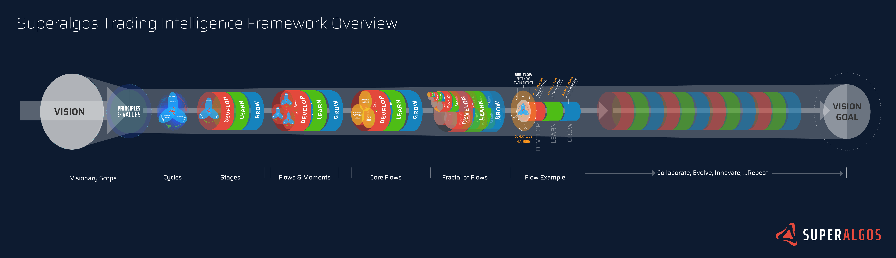

# SIP 015 - Superalgos Trading Intelligence Framework (TradeInt)

_The purpose of the Superalgos Trading Intelligence Framework is to create focus upon the envisioned "open global collaboration of humans and machines." The framework applies the Superalgos-specific vision and principles to a systematic order designed to guide and empower decentralized collaboration._  

## Introduction

The intent of this proposal is to introduce a project asset termed the "Superalgos Trading Intelligence Framework" (TradeInt). This asset is greatly inspired by the Superalgos Trading Protocol which, in part, creates a formal realization of the project vision by enabling evolution through the open global collaboration of humans and machines. The Trading Protocol specifically enables this collaboration by establishing a standardized language for communicating about the topic of _trading_ between human-to-human, human-to-machine, and machine-to-machine collaborators. In a similar fashion, the Trading Intelligence Framework will establish a unified understanding of how to implement a _superior trading intelligence_ by utilizing the project's vision and its core principles of collaboration, rapid-evolution and permissionless innovation. Thus the TradeInt Framework is a strategic business initiative focused on aligning decentralized collaborators to maximize productive synergy towards a common purpose. TradeInt is purposed for strategic development, community engagement, project onboarding and management.  

The Superalgos Project is a grand and complex undertaking with the vision for creating:

> ###**a superior trading intelligence evolving within an open global collaboration of humans and machines at the service of all people.**

However, such grandiosity and complexity has created the challenge of explaining _What is the Superalgos Project?_ and perhaps even more importantly, _How will the Superalgos Project fulfill its vision?_ The project has undergone a massive amount of evolution and much clarity to the _why, what and how_ of the project have already been sifted into determinable forms. Let us take this clarity to the next level and put it to constructive and actionable use.

The Superalgos Trading Intelligence Framework:

- unifies the Superalgos project by simplifying and clarifying the context of relationship, relevance and the interdependency between all project elements from the singular reference point of the project vision;
- is a mental model formed by and communicated through the foundational project vision and principles;
- forms an organized and methodical basis to cultivate collaborative focus, project management and intentional evolution;
- support external marketing and recruitment efforts by providing ongoing onboard and engagement to the project;  
- is a collection of documents, tools and other resources specifically designed to facilitate all previously listed points. 

 

#### TradeInt?

"Superalgos Trading Intelligence Framework" is quite a mouthful and a natural or friendlier short name will emerge. Currently lacking any sleek and appropriate alternatives, "TradeInt" is the current short name reference.

#### Status

As with the Superalgos project in general, the TradeInt Framework is ever-evolving and will grow in capacity and capability needed to fulfill its purpose.

Currently, TradeInt can:

- Align current and new project members to the project vision and principles.
- Onboard members to the complexity of project elements and their relationship in a simpler, clearer manner.

Next steps include:

- Establish framework acceptance through education, adoption and integration 
- Create tools that enable and enhance collaboration especially through:
	- project status awareness	
	- planning
	- assessment
	- community engagement
- Applying framework models to existing project elements
	- Core flows have initial implementation
	- Implementation to sub-flows required for meaningful project management utility
- Increase accessibility and guidance to framework theory and implementation
	- Framework is itself a collaboration and requires cultivating value, and therefore, demand to become organically sustainable

## Trading Intelligence Framework Definition

Read the current version of the [Superalgos Trading Intelligence Framework Definition](./)

## Issues

There are a number of strong assertions put forth by the Superalgos Trading Intelligence Framework:

1. The Superalgos vision and core principles are the projects source of Truth. In essence, they become the doctrine of the Superalgos project.
2. A "superior trading intelligence" is not merely _an artificial intelligence focused on trading_ but is actually **the collective intelligence of the Superalgos-guided global collaboration of humans and machines**.
3. Given the above point, the ability to fulfill the project's purpose is built heavily on the ability to facilitate collaboration. _Just_ technical development is not an option. Systems for pre-planning, post-assessment _and_ open communication of the ongoing process is a requirement for success. Thus is the overarching goal of TradeInt to facilitate and enable collaboration in every manner possible. 

 

  

