# SIP 015 - Superalgos Trading Intelligence Framework (TradeInt) Definition

#### [Work-in-progress]: The bulk intention of the framework structure is in place, but the ever-developing details are ongoing. However, intent of this definition should be perceivable despite being incomplete.

**Abstract:** The Superalgos project is undertaking a challenge rife with complexities that would be difficult to manage under the more optimal efficiency and guidance provided within a traditional centralized organization. However, the Superalgos vision and values require a level of accessibility and transparency only deliverable by a decentralized organization. Therefore a system to embrace these challenges and to optimize the benefits of decentralized organization must be created.

##### Table of Contents
1. [Introduction](#introduction) 
2. [Framework Theory](#framework-theory)
    - [How it works](#how-it-works)
    - [A quick tour](#a-quick-tour) 
3. [Framework Architecture](#framework-architecture)
    - [The Superalgos Vision](#the-superalgos-vision)
    - [Superalgos Principles and Values](#superalgos-principles-and-values)
    - [Cycles](#cycles)
    - [Stages](#stages)
    - [Flows and Moments](#flows-and-moments)
6. [Core Flows](#core-flows)
7. [Implementation](#implementation)
8. [Appendix](#appendix)

---

## Introduction

 

> ###The _Superalgos Trading Intelligence Framework_ is a system designed for enabling an open global collaboration of humans and machines 

The _Superalgos Trading Intelligence Framework (TradeInt)_ is a mental model that unifies the interdependent project elements within whilst clarifying their context, relevance and relationships. Analogously, if the Superalgos project is a large, complex building, the framework is the collection of strategies and tools, such as personal management and scaffolding, that enables construction.  

The key to this framework is that the Superalgos Project elements are not related by just their purpose of use, but by conceptual representation directly bound to the project's foundational principles and by extension, the project's vision. The purpose of the Trading Intelligence framework is for making use of that conceptual representation to strengthen and optimize the project's journey from vision to vision goal. Specifically, the framework goal is fo  rming a laser-focus towards building a _superior trading intelligence._

The purpose of this definition is to specify the why, what and how of the Superalgos Trading Intelligence Framework and is not optimized for primary external marketing. However, once an audience is engaged to a level of awareness and understanding of the project, it becomes an ideal tool to guide external stakeholders into becoming value contributors. 

_Note: At this time, the development of the TradeInt Framework has been concentrated in the higher-level abstract concepts of the project. Crafting and implementing concrete integrations of the framework will be a part of its lifetime journey.

## Framework Theory

### How it works

1. The Superalgos Trading Intelligence Framework works by presenting and guiding the Superalgos project through a lens of shared purpose. In short, utilizing TradeInt requires the following:
	- Understand the vision
	- Understand the principles
	- Use these understandings to strategically guide planning, development and assessment of project tasks.
	- Utilize tools and knowledge cultivated by framework to increase collaborative efficiency

2. The concise purpose of vision paired with the natural interdependent equilibrium of core principles provide a strong objective foundation for logical assessment and prioritization.

3. Segmentation and guidance provided by the three core principles along with established Agile methodologies provides a quantifiable landscape for strategic project management.  

As the framework is embraced and put to work, it will create a self-driving culture that will strongly guide the attitude and manner of all participants in the project. 

### A Quick Tour

TradeInt 

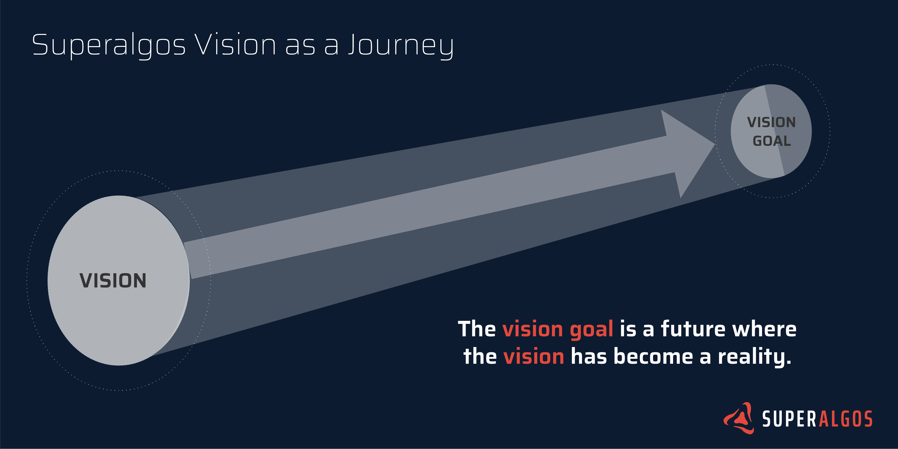 

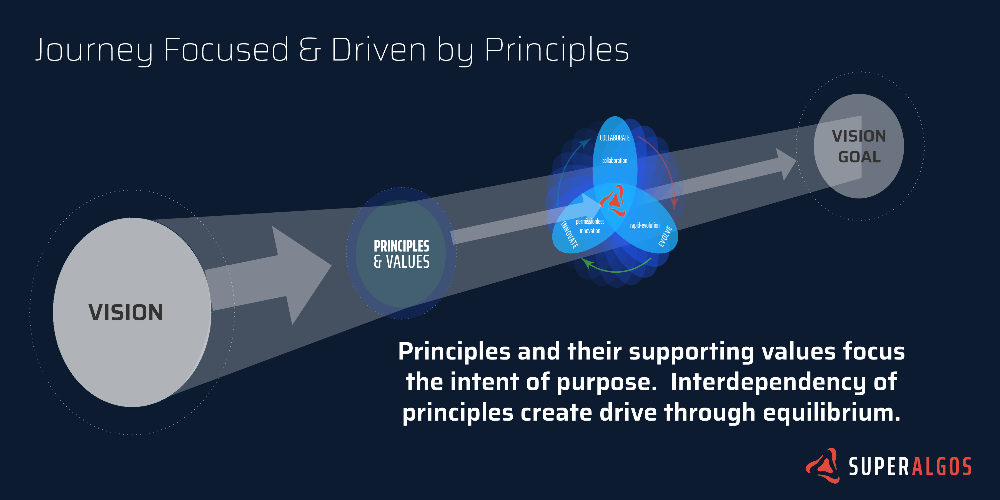 

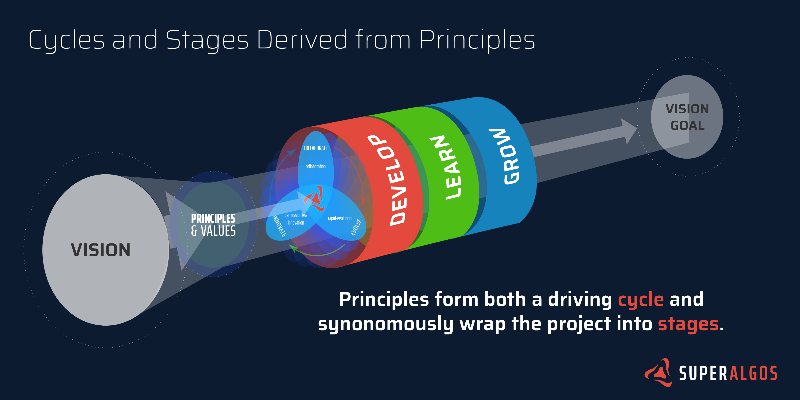 

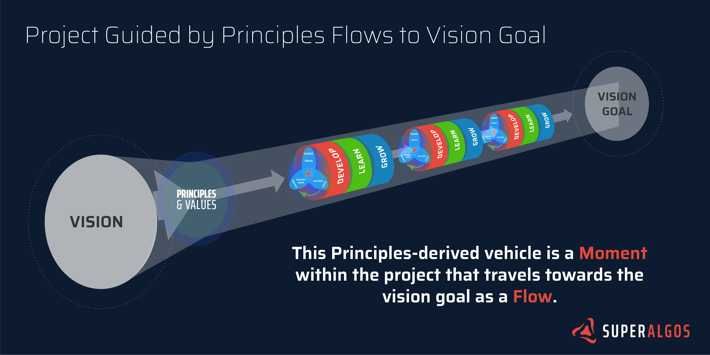 

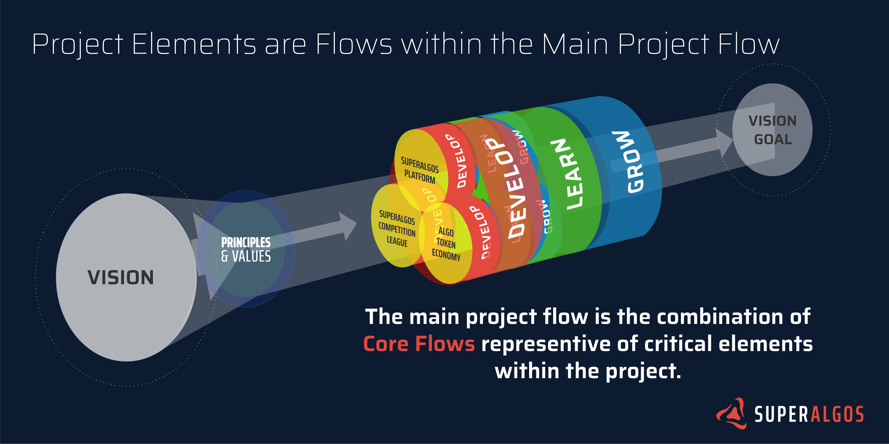 

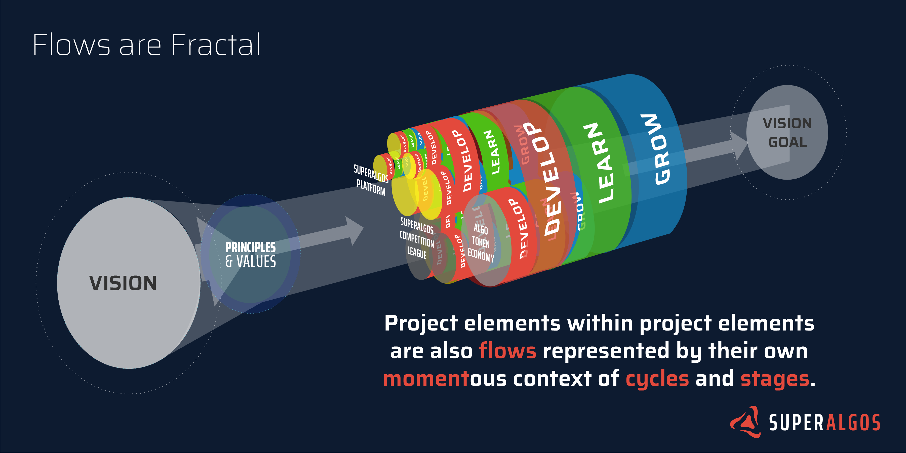 

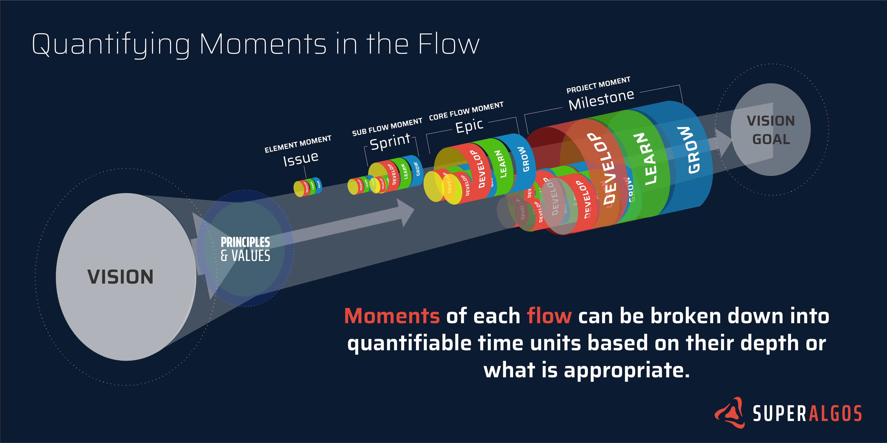 

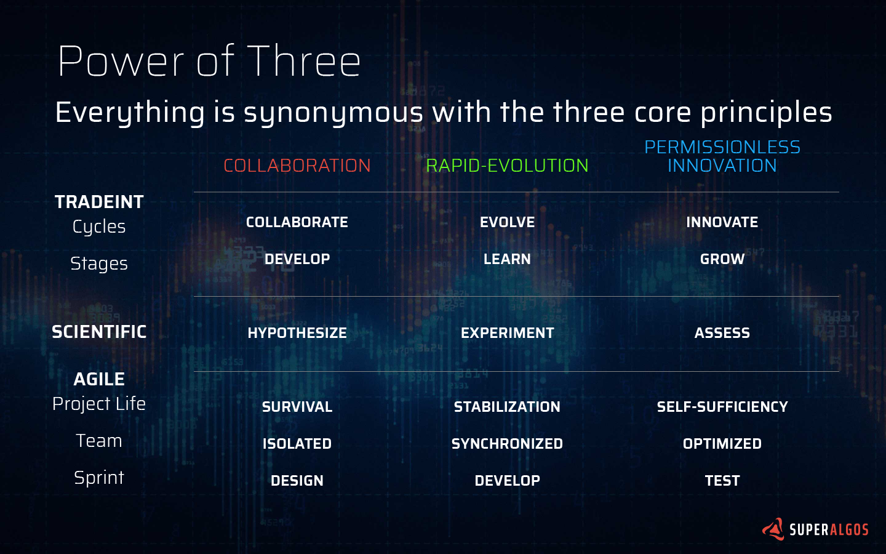 

# Framework Architecture

## The Superalgos Vision

### Relationship between Vision and Project

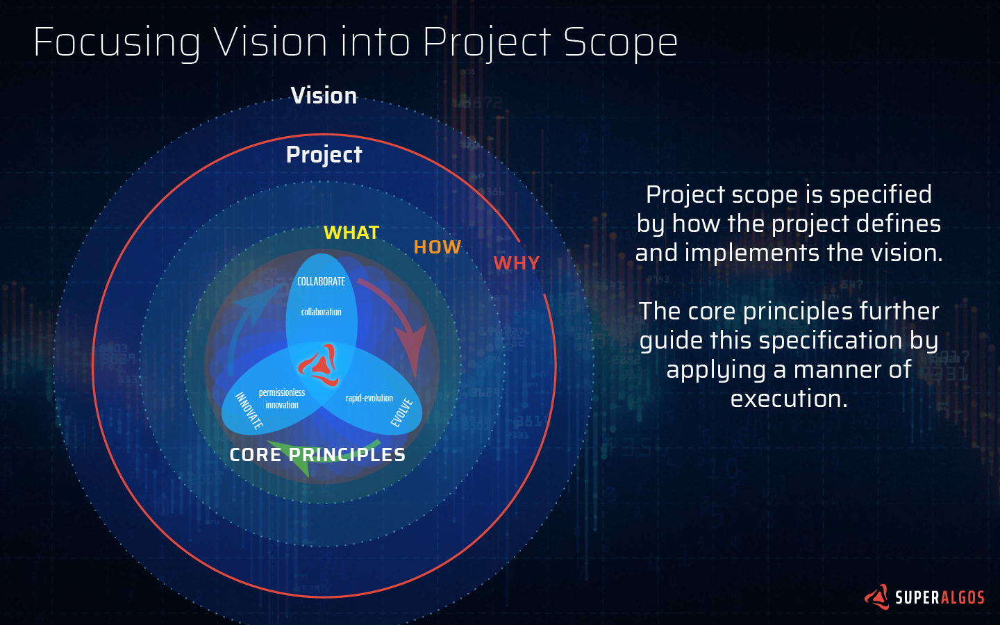

The vision of the Superalgos Project is to cultivate:
> ### **a superior trading intelligence evolving within an open global collaboration of humans and machines at the service of all people**. 

A vision cannot be owned and there are multiple paths for implementing that vision. Thus, the Superalgos Project is of a smaller scope within the greater vision. 

Defining the specific implementation of the project's vision is the guidance of three principles:

- Collaboration
- Rapid Evolution
- Permissionless Innovation

### Understanding the Vision

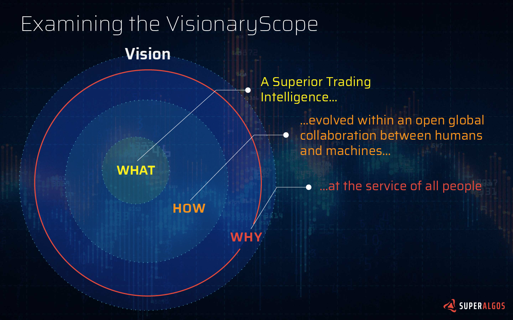

The vision can be segmented into a _what_, _how_ and _why_:

- **what**: _A superior trading intelligence..._
- **how**: _...evolving within an open global collaboration of humans and machines..._
- **why**: _...at the service of all people_

#### WHAT: A superior trading intelligence...

> #### What is a _superior trading intelligence_?

At the present time, most nouns paired with the word "intelligence" refer to some form of artificial intelligence (AI). While not yet a mainstream term, it is easy to associate "trading intelligence" to be "an artificial intelligence with a focus on trading." 

An overarching issue with the current views on "artificial intelligence" is that this technology is referenced and perceived in the purview of an end-product — that of a machine with a similar, if not greater, general intelligence than a human being. This view results in:

- perception that the purpose of AI is to replace humans;
- overlooking the long journey from the present day reality of machines — possessing narrow, mimicked intelligence — all the way to the dream of a mature and useful general AI. 

Setting aside the fear, uncertainty and doubt created by suc, the Superalgos project sidesteps these issues by embracing that long journey of creating such an intelligence. In doing so, is the recognized reality of required massive amounts of human time and intelligence. This time and intelligence will be given to machines, but for what purpose? So that machines can help humans do things that machines are really good at — like processing lots of data really fast — and eventually do it in a more intelligent manner. This in turn enables humans to concentrate on things they are good at such as non-linear abstraction and the dreams that derive a more beneficial future. From this is born a natural collaboration between humans _and_ machines and a sum intelligence of not just machines, but a collective intelligence of both humans and machines. 

A new view becomes available:

- AI is developed as a collaborative journey maximizing the potential of humans and machines. 

Thus in the Superalgos Project, to be clear, a _superior trading intelligence_ is NOT just an end-product. 

> **A _superior trading intelligence_ is the  journey of an ever-evolving trading collaboration and the sum collective trading intelligence of both humans and machines.** 

#### HOW: ...evolving within an open global collaboration of humans and machines...

At this point, we've nearly established that the **what** and **how** are one and the same. Leaving further the clarification as to the type of collaboration: one that is _open_ and _global_.

In contrast to many other AI projects, especially those with a focus on trading, the Superalgos collaboration is open to the whole world to any who wish to contribute. This is counter to the many other projects working in closely guarded silos that intend to retain the benefits for themselves. 

#### WHY: ...at the service of all people.

Half of the purpose of Superalgos is **what** it is building. Thus the other half of the project purpose is **why** it is building a _superior trading intelligence._

Nearly all trading intelligence technology is proprietary or only accessible to the already wealthy few. Such technology is closely guarded to maintain performance edge in the current marketplace, but is also held back under the guise of consumer safety within the trading industry. To be fair, there is indeed great potential risk, especially in automated trading at this time, but even the intellectual technology of risk management is held back. Yet, by creating accessibility for anyone to trade while minimizing knowledge on trading, especially that of risk management, the trading industry throws out any argument of safety. It merely makes the smaller, but far more numerous injections of value prey, to those holding all the tools and knowledge. 

The Superalgos project is changing this paradigm by making these tools and knowledge accessible. This may be perceived as a loss of removing the edge of market performance but in its place is the greater opportunity of larger markets, more markets and increased liquidity. Trading is not a zero-sum game.

> **The purpose of Superalgos is to build a _superior trading intelligence_ at the service of all people.** 

## Superalgos Principles and Values

How the project defines the vision specifies how it will implement that vision. Further guiding the manner of this implementation are three core values or principles:

- Collaboration
- Rapid Evolution
- Permissionless Innovation

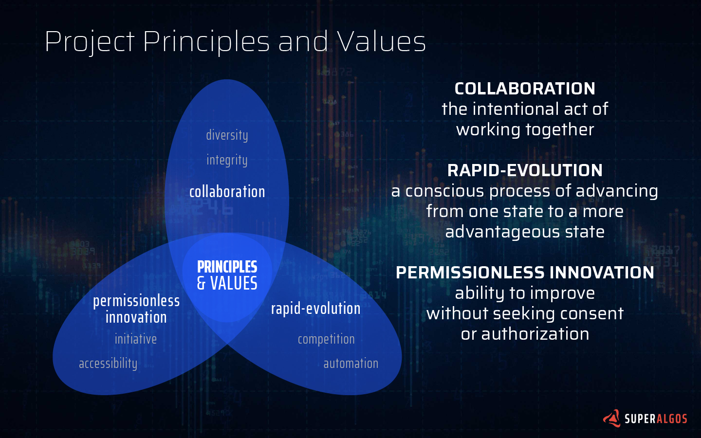

Each principle has two guiding values:

- _Collaboration_: diversity and integrity
- _Rapid-Evolution_: competition and automation
- _Permissionless Innovation_: initiative and accessibility

#### Collaboration

#### Rapid-Evolution

#### Permissionless Innovation

### Cycles

**Cycles** are generated by the motion created by seeking equilibrium between the three interdependent Superalgos Principles. By striving to achieve each of the principles, a constant equilibrium-seeking motion is generated. This motion place when focused around a point of purpose, the Superalgos Vision, creates spin. Thus, like a propellor, it can create forward momentum. 

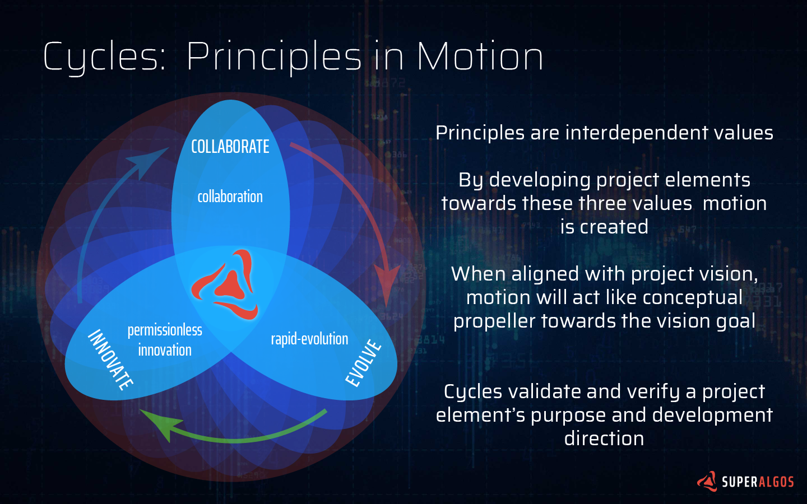

Forming the three propellor blades of a cycle are the simplified versions of the principles:

- Collaboration -> Collaborate
- Rapid-Evolution -> Evolve
- Permissionless Innovation -> Innovate

Implementation involves a constant assessment of these three principles applied to the given project element. How they are used to assess that element varies depending on the element and is determined when the project element is first designed. However, they all follow specific intentions true to their underlying principles:

1. Collaborate -
2. Evolve -
3. Innovate - 

### Stages

**Stages** are derived synonymously from the Principles and while cycles act as a source of drive, stages act as a source of stabilization and direction. In the physical analogy, if cycles are propellors, then stages act like three circular wings in a row. If all three wings are aligned, then the project flies straight.

Stages are a sequential process that any project element must complete before moving moving on to the next state, and usually, repeating the same sequential process.

The three stages corresponding to their Principle origin are:

- Collaboration -> Develop
- Rapid-Evolution -> Learn
- Permissionless Innovation -> Grow

As stages are implemented in terms of a process over time, they occur within a given order of time and always in the same sequential order: Develop, then Learn, then Grow. Moves to the next sequence of time, then repeats. 

Like cycles, the implementation of stages vary depending on the needs and functions of the given project element.  The relationship to the underlying principles and their purpose applies to each stage as well. 

Stages can be customized depending on the purpose of their project element and the time sequence they are applied. The Power of threes is a good starting example: 

 

Specific examples are the scientific and AGILE — both of which could be applied as stages. If the project element is scientific in nature, then it should always go through the stages of creating a hypothesis, experimenting, and then assessing the results and finally repeating. The same sequence and cycle goes for AGILE, though applied to different processes like software development.  

The guidance of each stage is as follows:

1. Develop -
2. Learn -
3. Grow - 

 

### Flows and Moments

Flows are project elements represented over the whole lifetime of the project.

Moments are a snapshot of the project element within a given sequence of time. The whole project may project moments in milestones that are months in length, while sub-flows may reflect moments in weeks as sprints, or issues in hours to days.  

Flows can be used to apply for and assess streams.

 

 

 

 

## Core Flows

 

Core flows are represented as critical project elements over the lifetime of the project. 

The main mission of the project is the implementation of its vision, so each core flow has their own mission to achieve towards the greater vision.

### TradeInt
Though not labeled as a core flow within the above illustration, the Framework can be seen at the same level as the project stages in their entirety. 

The same manner of cycles and stages apply to guiding the development and implementation of TradeInt.

**Cycles**:

- Collaborate:
- Evolve:
- Innovate:

**Stages**:

- Develop:
- Learn:
- Grow:

### Superalgos Platform
The Superalgos Platform is the tangible heart of the project and the main enabler of automated trading. It also incorporates the myriad of modules and tools that allow humans and machines to collaborate. 

#### Superalgos Trading Protocol

Though a subset of the Superalgos Platform, the Superalgos Trading Protocol is an essential project element. It can be described as a communication protocol to enable the trading collaboration of humans and machines:

- Collaborate -> Develop -> Platform development -> human-to-human
- Evolven -> Learn -> Competitions -> human-to-machine
- Innovate -> Grow -> Data + Token Integration -> machine-to-machine

Through it, humans can use it as a standard to learn about trading and developing strategies. The protocol also allows humans to communicate those strategies to machines, test them in competitions and learn from each other. Finally, machines can use it between each other to get data and even pay each other for their data dependencies. 

### Superalgo Competition League

The Superalgos Competition League is the main driver for learning and therefore rapid-evolution of the project.

- Develop -> Develop
- Learn -> Compete
- Grow -> Assess

### ALGO Token Economy

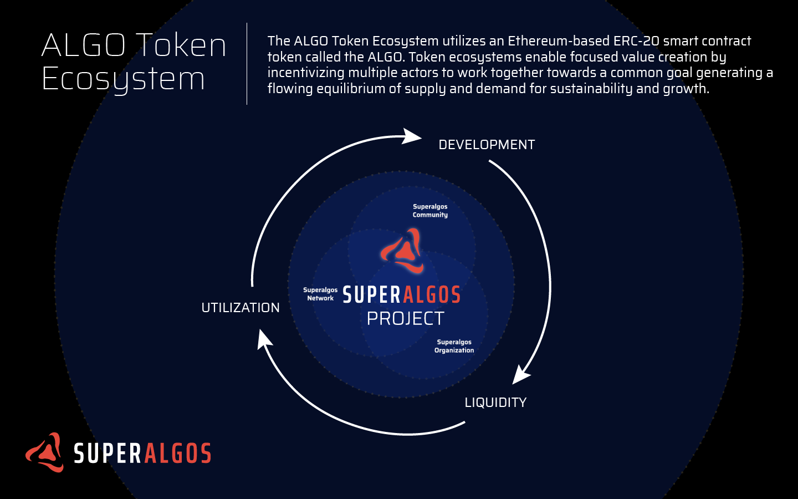 

- Develop -> Development
- Learn -> Liquidity
- Grow -> Utilization

## Implementation

One of the biggest challenges of a conceptual framework is implementing and integrating its abstract propositions into tangible actions. Exacerbating this challenge is the inevitable reality of additional processes that create more work. The challenge further lies in an ongoing balance of maintaining these additional inconveniences in exchange for greater potential value added to the process in both the short and long.

### Stages

1. **Stage 1**: Develop framework to enable aligning project contributors to project purpose, vision and principles. Focus is on clearly understanding and aligning with project.
2. **Stage 2**: Evolve framework to enable sub-flow implementation and basic project management. Focus is on implementing collaborative tools, metrics and processes. 
3. **Stage 1**: Expand framework to support higher-level theoretical research and processes. Focus is on increased efficiency and growing complexity. 

## Appendix

### Definitions [Todo]

Many of the Superalgos related definitions can be found on the main Superalgos Website. This framework introduces new definitions or alters the current existing set, both of which will listed here.

